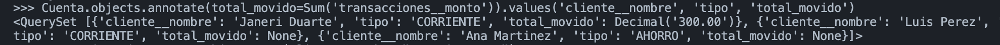
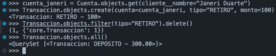

# Proyecto Módulo 7

Se desarrolla una aplicación web con **Django** para que los usuarios de Alke Wallet puedan gestionar sus activos financieros: crear cuentas digitales, realizar transacciones, consultar saldos y generar reportes. Dentro de la aplicación creada encontramos la siguiente estructura del proyecto, que lo titulé como Alke-Wallet:

```
alke-wallet/
├── config/                   # Configuración del proyecto
│   ├── settings.py           # Configuración de MySQL, apps, templates, static
│   ├── urls.py                # URLs raíz (admin, core, login/logout)
│   ├── __init__.py            # Configura PyMySQL como driver de MySQL
│   ├── asgi.py / wsgi.py
├── core/                      # App principal: modelos, vistas, admin, urls
│   ├── models.py              # Cliente, Cuenta, Transaccion, Etiqueta
│   ├── views.py                # Vistas CRUD basadas en clases + registro
│   ├── urls.py
│   ├── admin.py                # Registro de modelos en el panel admin
│   ├── tests.py
│   └── migrations/
├── templates/
│   ├── base.html                # Plantilla base con Bootstrap 5 + CSS propio
│   ├── registration/
│   │   ├── login.html          # Html con información para el ingreso
│   │   └── registro.html      # Html con información para el registro en la página
│   └── core/                     # Carpeta con contenidos HTML para movimientos de cuenta
│       ├── cuenta_list.html
│       ├── cuenta_detail.html
│       ├── cuenta_form.html
│       └── cuenta_confirm_delete.html
├── static/
│   └── css/estilos.css        # Estilos propios adicionales a Bootstrap
├── capturas/                   # Capturas de pantalla del Informe de Pruebas
├── venv/                        # Entorno virtual (no se sube a GitHub)
├── .env                          # Variables de entorno (no se sube a GitHub)
├── .gitignore
├── manage.py
└── requirements.txt
```

### 🖇️ Modelos y relaciones

- **Cliente** — extiende `User` de Django (relación **Uno a Uno**).
- **Cuenta** — pertenece a un Cliente (relación **Muchos a Uno**).
- **Transaccion** — pertenece a una Cuenta (relación **Muchos a Uno**) y puede tener varias **Etiquetas** (relación **Muchos a Muchos**).

## ⚙️ Configuración realizada

- Base de datos: **MySQL**, configurada vía `PyMySQL` como driver (`config/__init__.py`) para evitar problemas de compilación nativa en macOS.
- Autenticación con `django.contrib.auth` (login, logout y registro de nuevos usuarios).
- Panel de administración con `django.contrib.admin` (modelos registrados con `list_display` y `search_fields`).
- Archivos estáticos servidos con `django.contrib.staticfiles`.
- Formularios protegidos con ``, incluyendo el logout (implementado como `POST`, no `GET`).
- Frontend estilizado con **Bootstrap 5** + **Bootstrap Icons** (vía CDN) y CSS propio (`static/css/estilos.css`) con paleta bancaria (azul marino + verde acento).

## 📋 Instrucciones para ejecutar el proyecto localmente

1. Clonar el repositorio:
   ```bash
   git clone https://github.com/janeriduarte-pixel/alke-wallet.git
   cd alke-wallet
   ```
2. Crear y activar un entorno virtual:
   ```bash
   python3 -m venv venv
   source venv/bin/activate
   ```
3. Instalar dependencias:
   ```bash
   pip install -r requirements.txt
   ```
4. Configurar la base de datos MySQL (crear la base `alke_wallet_db` y un usuario con permisos) y ajustar las credenciales en `config/settings.py`.
5. Aplicar migraciones:
   ```bash
   python manage.py migrate
   ```
6. Crear un superusuario:
   ```bash
   python manage.py createsuperuser
   ```
7. Ejecutar el servidor de desarrollo:
   ```bash
   python manage.py runserver
   ```
8. Abrir en el navegador:
   - Aplicación: `http://127.0.0.1:8000/cuentas/`
   - Registro: `http://127.0.0.1:8000/accounts/registro/`
   - Panel de administración: `http://127.0.0.1:8000/admin/`

---

# 🧪📸 Informe de Pruebas (capturas de pantalla)

Las pruebas se ejecutaron de forma manual desde la **shell interactiva de Django** (`python manage.py shell`), validando las operaciones CRUD completas y las consultas personalizadas sobre los modelos `Cliente`, `Cuenta`, `Transaccion` y `Etiqueta`, conectados a la base de datos **MySQL**.

**Para iniciar la shell:**
```bash
python manage.py shell
```

**E importar los modelos necesarios:**
```python
from core.models import Cliente, Cuenta, Transaccion, Etiqueta
from django.contrib.auth.models import User
from django.db.models import Sum, Count
from django.db import connection
```

### 1. `CREATE`: Crear un Cliente

```python
from core.models import Cliente
from django.contrib.auth.models import User
user_prueba = User.objects.create_user(username='carlos', password='clave123')
cliente_prueba = Cliente.objects.create(usuario=user_prueba, nombre="Carlos Gómez", email="carlos@example.com", telefono="3001234567")
print(cliente_prueba)
print(cliente_prueba.nombre, cliente_prueba.email, cliente_prueba.telefono)
```

**Resultado esperado:** Se crea un nuevo usuario y su Cliente asociado (relación Uno a Uno), sin error.
**Resultado obtenido:** ✅


### 2. `READ` con `filter()`, `values()` y `exclude()`

```python
Cuenta.objects.filter(saldo__gte=1000)
```

**Resultado esperado:** Devuelve únicamente las cuentas con saldo mayor o igual a 1000.
**Resultado obtenido:** ✅


```python
Cuenta.objects.values('cliente__nombre', 'tipo', 'saldo')
```

**Resultado esperado:** Muestra los nombres de los clientes, el tipo de cuenta y los saldos de estas cuentas.
**Resultado obtenido:** ✅


```python
Cuenta.objects.exclude(tipo="CORRIENTE")
```

**Resultado esperado:** Devuelve únicamente las cuentas que NO son de tipo CORRIENTE (es decir, las de AHORRO).
**Resultado obtenido:** ✅


### 3. `UPDATE`: Actualizar el saldo de una Cuenta

```python
cuenta_carlos = Cuenta.objects.create(cliente=cliente_prueba, tipo="AHORRO", saldo=500)
print(cuenta_carlos.saldo)   # Antes: 500.00

cuenta_carlos.saldo = 900
cuenta_carlos.save()
print(Cuenta.objects.get(pk=cuenta_carlos.pk).saldo)   # Después: 900.00
```

**Resultado esperado:** El saldo cambia de su valor original a 900.00 y persiste en la base de datos.
**Resultado obtenido:** ✅


### 4. Consulta avanzada con `annotate()` (Count)

```python
Cliente.objects.annotate(total_cuentas=Count('cuentas'))
```

**Resultado esperado:** Cada cliente aparece anotado con el número de cuentas que posee.
**Resultado obtenido:** ✅


### 5. Consulta avanzada con `annotate()` (Sum)

```python
Cuenta.objects.annotate(total_movido=Sum('transacciones__monto')).values('cliente__nombre', 'tipo', 'total_movido')
```

**Resultado esperado:** Cada cuenta muestra la suma total de sus transacciones (o `None` si no tiene ninguna).
**Resultado obtenido:** ✅



### 6. Relación Muchos a Muchos (Transacción ↔ Etiqueta)

```python
cuenta_janeri = Cuenta.objects.get(cliente__nombre="Janeri Duarte")
transaccion_deposito = Transaccion.objects.filter(cuenta=cuenta_janeri, tipo="DEPOSITO").first()
transaccion_deposito.etiquetas.all()
```

**Resultado esperado:** La transacción de depósito aparece asociada a las etiquetas creadas previamente.
**Resultado obtenido:** ✅


### 7. Consulta SQL personalizada con `raw()`

```python
list(Cliente.objects.raw("SELECT * FROM core_cliente WHERE telefono IS NOT NULL"))
```

**Resultado esperado:** Devuelve solo los clientes que tienen un teléfono registrado.
**Resultado obtenido:** ✅


### 8. Consulta con cursor directo

```python
cursor = connection.cursor()
cursor.execute("SELECT COUNT(*) FROM core_cuenta")
cursor.fetchone()
```

**Resultado esperado:** Devuelve el conteo total de registros en la tabla `core_cuenta`.
**Resultado obtenido:** ✅


### 9. `DELETE()`: Eliminar una Transacción

```python
cuenta_janeri = Cuenta.objects.get(cliente__nombre="Janeri Duarte")
Transaccion.objects.create(cuenta=cuenta_janeri, tipo="RETIRO", monto=100)
Transaccion.objects.filter(tipo="RETIRO").delete()
Transaccion.objects.all()
```

**Resultado esperado:** El registro de tipo RETIRO se elimina y ya no aparece en las consultas posteriores.
**Resultado obtenido:** ✅ 


